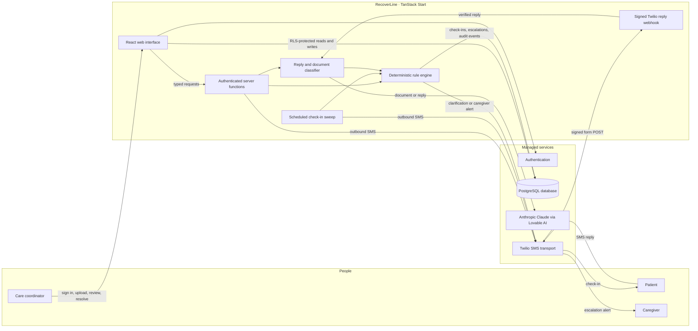
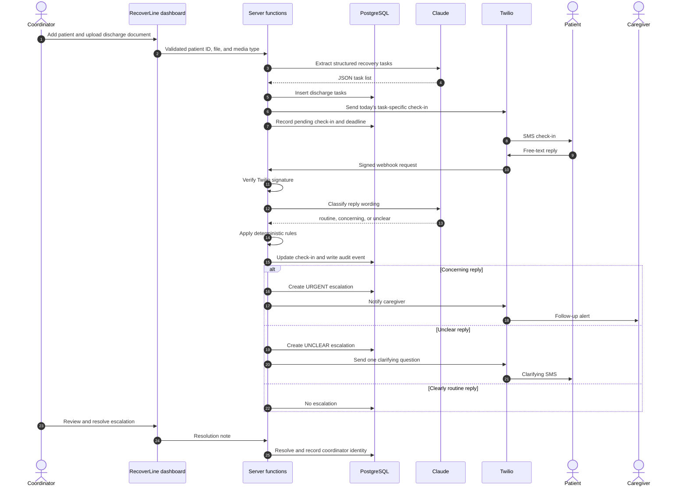
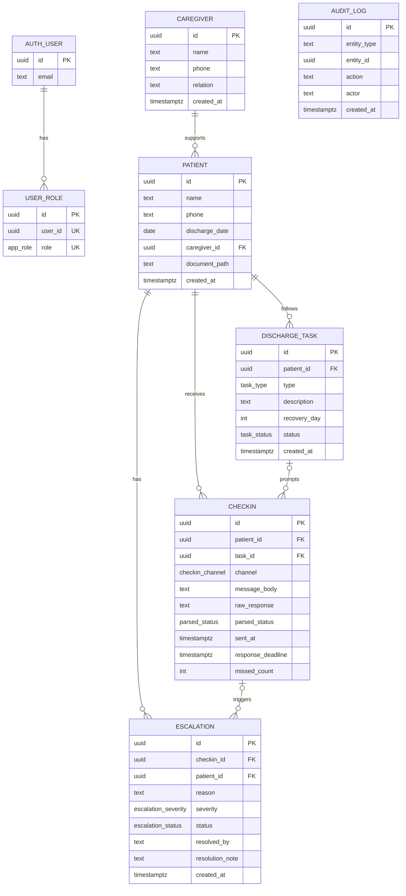

# **RecoverLine**

**Post-discharge recovery check-ins by SMS, with deterministic escalation to a caregiver when a patient reports a concern or cannot be reached.**

[Open the published application](https://health-check-relay.lovable.app)

> [!IMPORTANT]
> RecoverLine is a TigerHacks health-theme prototype. It uses synthetic demo data only, is not a certified medical device, is not HIPAA-compliant, gives no medical advice, and is not connected to an electronic health record (EHR).

## Contents

- [Problem statement](#problem-statement)
- [The evidence-backed gap](#the-evidence-backed-gap)
- [Solution](#solution)
- [How RecoverLine solves the problem](#how-recoverline-solves-the-problem)
- [System architecture](#system-architecture)
- [End-to-end workflow](#end-to-end-workflow)
- [Deterministic escalation rules](#deterministic-escalation-rules)
- [Database and ER diagram](#database-and-er-diagram)
- [Product experience](#product-experience)
- [Security and safety model](#security-and-safety-model)
- [Technology stack](#technology-stack)
- [Run after cloning](#run-after-cloning)
- [External service setup](#external-service-setup)
- [Demo and verification](#demo-and-verification)
- [Current prototype limitations](#current-prototype-limitations)
- [Project structure](#project-structure)
- [Sources](#sources)
- [Published application](#published-application)

## Problem statement

Hospital discharge moves responsibility from a clinical team to a patient at a moment when the patient may still be tired, unwell, medicated, or overwhelmed. The patient often leaves with dense instructions covering medication, wound care, warning signs, and follow-up appointments. Once home, there may be no lightweight way to confirm that the plan is being followed or to notice that the patient needs human attention.

Traditional patient portals and new mobile applications add another login, installation, or workflow. RecoverLine focuses instead on SMS: a channel already available on nearly every phone and familiar to patients and caregivers.

## The evidence-backed gap

The gap between receiving discharge information and correctly acting on it is documented in patient-safety research:

- A 2023 study summarized by the U.S. Agency for Healthcare Research and Quality found that more than 90% of patients felt confident about their diagnosis and treatment plan, but only **43%–64%** correctly recalled details about their diagnosis, treatment, post-discharge plan, and medication changes.[^1]
- An AHRQ patient-safety primer reports that nearly **20% of patients experience an adverse event within three weeks of discharge**, and that nearly three-quarters of those events could have been prevented or reduced.[^2]
- A prospective study of 328 discharged medical patients found that **23% experienced at least one adverse event** after discharge.[^3]
- In another prospective cohort, **11% of evaluated patients experienced an adverse drug event** after discharge; 27% were judged preventable and 33% ameliorable.[^4]
- Research involving older patients found that nearly **20% did not understand either their diagnosis or how to care for themselves at home**, while most did not know the expected course of illness or when to return for care.[^5]

These findings do not imply that an automated system should diagnose patients. They support a narrower need: turn discharge instructions into timely prompts, make it easy for patients to respond, and route uncertain or concerning situations to a person.

## Solution

RecoverLine converts a discharge document into a day-by-day recovery plan, sends task-specific SMS check-ins, interprets a patient's free-text reply into a small structured status, and then applies fixed rules to decide what happens next.

The central safety boundary is deliberate:

> **AI classifies the wording of a reply. Deterministic code decides whether and how to escalate.**

The patient installs nothing. A care coordinator uses the dashboard; the patient replies by text; a caregiver receives an alert when the deterministic rules require human follow-up.

## How RecoverLine solves the problem

1. **Create the patient and caregiver record.** A coordinator enters synthetic patient and caregiver details. Phone numbers are normalized to E.164 format.
2. **Upload the discharge document.** An image or PDF is sent to Claude, which returns structured recovery tasks with a type and recovery-day offset.
3. **Build the recovery timeline.** The extracted tasks are stored as medication, wound-care, follow-up, or warning-sign actions.
4. **Send the relevant check-in.** On the matching recovery day, the scheduler or coordinator sends an SMS that references that day's task.
5. **Receive a signed reply.** Twilio posts the patient's reply to the public webhook. RecoverLine validates `X-Twilio-Signature` before reading or writing patient data.
6. **Classify, then apply rules.** Claude maps the text to `routine`, `concerning`, or `unclear`. Plain code creates any escalation, sends one clarification, retries a missed check-in, or alerts the caregiver.
7. **Coordinate follow-up.** The dashboard shows patient status, timeline, check-in history, and open escalations. A coordinator can resolve an escalation with an optional note.
8. **Keep an audit trail.** Check-in and escalation events are written to a reverse-chronological audit log.

## System architecture



### Responsibility boundaries

| Layer | Responsibility |
| --- | --- |
| React interface | Coordinator workflow, filtering, timeline, check-in history, escalation resolution, and audit visibility |
| Authenticated server functions | Validate inputs and perform document extraction, manual check-in sending, reply simulation, and escalation resolution |
| Claude | Convert documents into structured tasks and free-text replies into a structured status; it does **not** decide escalation |
| Deterministic rule engine | Apply the auditable escalation table and create notifications and audit events |
| PostgreSQL | Persist patients, caregivers, tasks, check-ins, escalations, roles, and audit events |
| Twilio | Transport outbound SMS and deliver inbound replies; no decision logic lives in Twilio |
| Scheduled sweep | Send due check-ins and process expired reply windows |

## End-to-end workflow



## Deterministic escalation rules

The classifier can return only `routine`, `concerning`, or `unclear`. Failure to parse the model response fails safe to `unclear`; ambiguity never silently becomes routine.

| Observed event | Stored status / severity | Deterministic action |
| --- | --- | --- |
| Reply is clearly positive and unambiguous | `routine` | Record the reply and audit event; do not escalate |
| Reply clearly reports a symptom, pain, bleeding, fever, swelling, confusion, or inability to complete care | `concerning` → `URGENT` | Open an urgent escalation and notify the caregiver |
| Reply is ambiguous, hedged, sarcastic, off-topic, partial, or cannot be parsed | `unclear` → `UNCLEAR` | Open a human-review escalation and send exactly one clarifying text |
| First response deadline passes without a reply | `WATCH` | Record the first missed attempt and resend the same check-in once |
| Second response deadline passes without a reply | `CONTACT_FAILURE` | Open a contact-failure escalation and notify the caregiver |

`CONTACT_FAILURE` means only **“we could not reach the patient after two attempts.”** It is never represented as evidence that the patient's health declined.

The prototype uses a five-minute response window so judges can demonstrate both missed-attempt states quickly. A production implementation would use a clinically reviewed window measured in hours, not minutes.

## Database and ER diagram

All primary keys are UUIDs. Clinical demo records are protected by row-level security. Access to patients, caregivers, tasks, and check-ins requires both an authenticated session and the `coordinator` role.



### Deletion behavior

- Deleting a patient cascades to that patient's tasks, check-ins, and escalations.
- Deleting a caregiver leaves the patient in place and sets `caregiver_id` to `NULL`.
- Deleting a task leaves its historical check-ins in place and sets `task_id` to `NULL`.
- Deleting a check-in cascades to escalations created from that check-in.
- Audit entries are independent records and intentionally use a descriptive entity reference rather than a foreign key.

## Product experience

### Public pages

- `/` — product explanation, animated SMS example, three-step workflow, rule summary, and prototype disclosure.
- `/about` — scope, safety boundaries, technology disclosure, and explicit statements that the prototype is not a medical device, is not HIPAA-compliant, and stores synthetic data only.
- `/auth` — care-coordinator email/password sign-in and account creation.

### Authenticated coordinator pages

- `/dashboard` — sortable and filterable patient list, current status, recovery timeline, check-in history, open and resolved escalations, manual check-in sending, and simulated replies.
- `/patients/new` — patient and caregiver intake, E.164 phone validation, discharge date, and image/PDF upload.
- `/audit` — reverse-chronological log of check-in and escalation activity.

The dashboard ships with five synthetic patients covering Routine, Watch, Urgent, Unclear, and Contact Failure states. The reset action restores those fixed demo records relative to the current date without deleting coordinator-added patients.

## Security and safety model

- **Synthetic data only:** the interface explicitly tells users not to enter real patient information.
- **Role-gated data:** patient, caregiver, task, and check-in policies require the authenticated user to hold the `coordinator` role.
- **Protected application operations:** internal mutations use authenticated TanStack server functions and Zod validation.
- **Signed inbound SMS:** the Twilio webhook rebuilds the public request URL and validates `X-Twilio-Signature` using HMAC-SHA1 and a timing-safe comparison.
- **Rejected request logging:** invalid Twilio signatures are rejected with HTTP 401 and recorded in the audit log.
- **Secrets remain server-side:** the Claude gateway key, Twilio connection key, Twilio sending number, Twilio Auth Token, scheduler secret, and privileged database credentials must never be placed in browser code or committed files.
- **Row-level security:** database policies prevent anonymous access to patient records.
- **Deterministic safety decisions:** AI output cannot directly create a severity. The rule engine maps a validated classification to explicit actions.
- **Fail-safe ambiguity:** malformed model output and uncertain patient language become `UNCLEAR`, not `routine`.
- **No diagnosis:** a missed response becomes `CONTACT_FAILURE`, not a claim about health.
- **Leaked-password protection:** authentication checks new passwords against known leaked-password data.

This model is appropriate for a synthetic hackathon demonstration. It is not a substitute for clinical validation, regulatory review, operational monitoring, incident response, or a production security assessment.

## Technology stack

| Area | Technology |
| --- | --- |
| Full-stack framework | TanStack Start v1 and TanStack Router |
| Interface | React 19, TypeScript, Tailwind CSS v4 |
| Client data | TanStack Query |
| Validation | Zod |
| Backend | Lovable Cloud with PostgreSQL, authentication, row-level security, and scheduled jobs |
| AI | Anthropic Claude through the Lovable AI Gateway |
| Messaging | Twilio Programmable Messaging |
| Build tooling | Vite |
| Schema migrations | SQL migrations with Drizzle configuration |

## Run after cloning

### Prerequisites

- Node.js 20 or later
- npm, Bun, pnpm, or Yarn
- A connected Lovable Cloud backend, or an equivalent PostgreSQL/Auth environment
- A Lovable AI credential for document and reply classification
- Optional: a Twilio account and SMS-capable number for real messages

### 1. Clone and install

```bash
git clone <your-repository-url>
cd <your-repository-directory>
npm install
```

### 2. Configure local environment values

Create `.env.local` for local development. Do not commit it.

```dotenv
# Browser-safe backend configuration
VITE_SUPABASE_URL=<your-backend-url>
VITE_SUPABASE_PUBLISHABLE_KEY=<your-publishable-key>

# Server-side backend configuration
SUPABASE_URL=<your-backend-url>
SUPABASE_PUBLISHABLE_KEY=<your-publishable-key>
SUPABASE_SERVICE_ROLE_KEY=<server-only-privileged-key>

# AI gateway — server only
LOVABLE_API_KEY=<your-lovable-ai-key>

# Twilio — server only; required for real SMS and signed inbound replies
TWILIO_API_KEY=<your-lovable-twilio-connection-key>
TWILIO_FROM_NUMBER=<your-e164-twilio-number>
TWILIO_AUTH_TOKEN=<your-twilio-auth-token>

# Scheduler authentication, if the deployment invokes the sweep with a bearer token
LOVABLE_CRON_SECRET=<strong-random-secret>

# Used only when applying migrations through Drizzle
LOVABLE_DB_MIGRATION_URL=<postgres-migration-connection-string>
```

When the project is opened through Lovable, the managed backend values and `LOVABLE_API_KEY` are injected by the platform. Store private values in the project's secure secret store rather than in a committed environment file.

### 3. Apply the database migrations

Apply the SQL files in `drizzle/migrations/` in filename order:

1. `0000_recoverline_schema_and_seed.sql` — schema, grants, row-level security, and synthetic seed data.
2. `0001_reset_demo_data.sql` — date-relative demo reset function.
3. `0002_coordinator_role_rls.sql` — coordinator role table and role-based policies.

Existing authentication users are granted the coordinator role when migration `0002` runs. Accounts created later must receive a `coordinator` row through a trusted administrative process before they can access patient data.

If `LOVABLE_DB_MIGRATION_URL` is configured, the migrations can be applied with Drizzle Kit:

```bash
npx drizzle-kit migrate
```

### 4. Start the application

```bash
npm run dev
```

Open the local URL printed by Vite. In Lovable's hosted development environment, the preview runs on port `8080`.

### 5. Optional quality checks

```bash
npm run lint
npm run build
```

To inspect the production build locally:

```bash
npm run preview
```

## External service setup

### Twilio messaging

Twilio is only the transport layer. It sends outbound messages and forwards replies; all classification and escalation logic remains inside RecoverLine.

1. Connect a Twilio account and obtain an SMS-capable number.
2. Store `TWILIO_API_KEY`, `TWILIO_FROM_NUMBER`, and `TWILIO_AUTH_TOKEN` as server-side secrets.
3. Set the number's **incoming message webhook** to:

   ```text
   https://health-check-relay.lovable.app/api/public/twilio/reply
   ```

4. Select HTTP `POST` for the webhook method.
5. Keep Twilio signature validation enabled; do not proxy or rewrite the public webhook URL without updating the validation assumptions.

Twilio trial accounts can generally send only to verified recipient numbers, add trial branding to messages, and may restrict international messaging. The dashboard's **Simulate check-in** control exercises the same classifier and deterministic rule engine without depending on carrier delivery.

### Scheduled sweep

The scheduler should call the following endpoint every minute during a live demo:

```text
POST https://health-check-relay.lovable.app/api/public/cron/sweep
```

The sweep:

1. Finds each task whose `recovery_day` matches the patient's current recovery day.
2. Sends at most one task check-in per patient per day.
3. Finds pending check-ins whose five-minute deadline has passed.
4. Applies the first-miss retry or second-miss contact-failure rule.

For any deployment outside the managed setup, protect scheduler invocation with a platform scheduler secret or equivalent trusted-caller control before using real integrations.

## Demo and verification

### Recommended judge flow

1. Open the published landing page and review the safety rule table.
2. Sign in as an approved coordinator.
3. Select each seeded patient to show the five distinct states.
4. Open a patient and review the recovery timeline and check-in history.
5. Under **Simulate check-in**, enter a clearly concerning reply such as:

   ```text
   I have a fever and the wound is bleeding.
   ```

   The classifier should return `concerning`; deterministic code should create an `URGENT` escalation.
6. Enter an ambiguous reply such as:

   ```text
   I guess it is probably okay.
   ```

   It should become `UNCLEAR`, open a human-review escalation, and attempt one clarifying text.
7. Resolve an escalation with a note and verify the coordinator identity appears.
8. Open the audit log and confirm the check-in, parsed reply, escalation, and resolution events appear newest first.
9. If Twilio is configured, send today's check-in to a verified test number, reply by SMS, and confirm the same state change appears in the dashboard.

### Safety cases to verify

| Test | Expected result |
| --- | --- |
| Clear positive reply | `routine`; no escalation |
| Symptom report | `URGENT`; caregiver notification attempted |
| Ambiguous reply | `UNCLEAR`; one clarification attempted |
| Invalid Twilio signature | HTTP 401; rejected request audited |
| First expired deadline | `WATCH`; same message resent once |
| Second expired deadline | `CONTACT_FAILURE`; caregiver notification attempted |
| Signed-out patient query | No patient data returned |

## Current prototype limitations

- **Synthetic demo only:** the system must not contain real patient information.
- **No compliance claim:** it has not completed HIPAA, medical-device, clinical-safety, accessibility, penetration-testing, or production-readiness review.
- **No EHR integration:** discharge documents are uploaded manually.
- **AI extraction requires review:** a coordinator should verify generated recovery tasks before any production use.
- **Five-minute window:** chosen only to make missed-reply behavior visible during a demo.
- **One daily task check-in:** the current sweep selects the first task matching that patient's recovery day.
- **Twilio trial constraints:** real messaging depends on an active number, verified recipients, geographic permissions, and carrier delivery.
- **Role provisioning is administrative:** a newly created account cannot access clinical demo records until it receives the coordinator role.
- **Prototype scheduling:** a published deployment must point its scheduled job at the live URL, not a temporary preview URL.

## Project structure

```text
src/
├── components/
│   ├── app-shell.tsx               # Authenticated navigation shell
│   ├── backdrop.tsx                # Landing/auth visual motion
│   └── status-label.tsx            # Status-specific indicators
├── integrations/supabase/          # Generated browser/server clients and auth middleware
├── lib/
│   ├── queries.ts                  # Dashboard and audit data queries
│   ├── recoverline.ts              # Shared domain types and display helpers
│   ├── recoverline.functions.ts    # Authenticated server functions
│   └── rule-engine.server.ts       # AI parsing, SMS transport, deterministic rules
├── routes/
│   ├── index.tsx                   # Public landing page
│   ├── about.tsx                   # Scope and policy
│   ├── auth.tsx                    # Coordinator authentication
│   ├── _authenticated/             # Dashboard, add patient, audit log
│   └── api/public/
│       ├── cron/sweep.ts            # Scheduled check-in and deadline sweep
│       └── twilio/reply.ts          # Signed inbound SMS webhook
└── styles.css                       # RecoverLine design tokens and motion

drizzle/migrations/
├── 0000_recoverline_schema_and_seed.sql
├── 0001_reset_demo_data.sql
└── 0002_coordinator_role_rls.sql
```

## Sources

[^1]: Townshend R, Grondin C, Gupta A, et al. “Assessment of patient retention of inpatient care information post-hospitalization.” *Joint Commission Journal on Quality and Patient Safety* (2023), summarized by [AHRQ Patient Safety Network](https://psnet.ahrq.gov/issue/assessment-patient-retention-inpatient-care-information-post-hospitalization).
[^2]: AHRQ Patient Safety Network. [“Readmissions and Adverse Events After Discharge”](https://psnet.ahrq.gov/primer/readmissions-and-adverse-events-after-discharge), reviewed June 2024.
[^3]: Forster AJ, Clark HD, Menard A, et al. [“Adverse events among medical patients after discharge from hospital”](https://pmc.ncbi.nlm.nih.gov/articles/PMC331384/). *CMAJ* (2004).
[^4]: Forster AJ, Murff HJ, Peterson JF, Gandhi TK, Bates DW. [“Adverse Drug Events Occurring Following Hospital Discharge”](https://pmc.ncbi.nlm.nih.gov/articles/PMC1490089/). *Journal of General Internal Medicine* (2005).
[^5]: Hastings SN, Barrett A, Weinberger M, et al. “Older Patients' Understanding of Emergency Department Discharge Information and Its Relationship With Adverse Outcomes,” summarized by [AHRQ Patient Safety Network](https://psnet.ahrq.gov/issue/older-patients-understanding-emergency-department-discharge-information-and-its-relationship).

## Published application

**[https://health-check-relay.lovable.app](https://health-check-relay.lovable.app)**